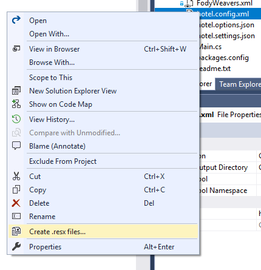

# XmlToResx

<!-- Replace this badge with your own-->

<!-- Update the VS Gallery link after you upload the VSIX-->
Download this extension from the [VS Gallery](https://visualstudiogallery.msdn.microsoft.com/[GuidFromGallery])
or get the [CI build](http://vsixgallery.com/extension/d4b8917a-e4ae-46b9-b075-75f1bd2975c9/).

---------------------------------------

Allows to create .resx file for differents cultures based on .xml metadata
the nodes exported to resx files should be under the following format:

**< myNodeName >** 
	< text id="fr-CA" lang="fr-CA" value="Page principale" /> 
	< text id="en-US" lang="en-US" value="Start page..." /> 
	< text id="ar-LB" lang="ar-LB" value="الصفحة الرئيسية" /> 
	..... 
**< /myNodeName >**

See the [change log](CHANGELOG.md) for changes and road map.

## Features

- Exporting standard nodes
- Generating resx file for three cultures :en-US,fr-CA and ar-LB

### Exporting some standard nodes
Export all nodes named like: caption, description or string.

### Generating resx file for three cultures :en-US,fr-CA and ar-LB
the three resx files will be generated under project properties

## Contribute
Check out the [contribution guidelines](CONTRIBUTING.md)
if you want to contribute to this project.

For cloning and building this project yourself, make sure
to install the
[Extensibility Tools 2015](https://visualstudiogallery.msdn.microsoft.com/ab39a092-1343-46e2-b0f1-6a3f91155aa6)
extension for Visual Studio which enables some features
used by this project.

## License
[Apache 2.0](LICENSE)